<div align="center">

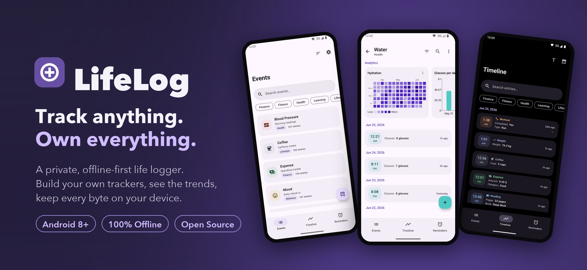

<br/>

# LifeLog

### Track anything. Own everything.

A private, offline-first life logger for Android. Design your own trackers, watch the trends emerge, and keep every byte on your device.

<br/>

[](https://www.android.com)
[-3DDC84)](https://developer.android.com)
[](https://kotlinlang.org)
[](https://developer.android.com/jetpack/compose)
[](https://m3.material.io)
[](LICENSE)
[](https://github.com/Arkadipta/LifeLog/releases)

</div>

<br/>

## Overview

Most tracking apps decide what you are allowed to measure, then quietly ship your data to someone else's server. LifeLog takes the opposite position on both.

You define the trackers. A blood pressure log, a habit streak, a coffee counter, a spending journal, a mood check-in: each one is an event type with exactly the fields you choose. Log entries as life happens, and LifeLog turns them into clean charts, a unified timeline, and timely reminders.

And the data is yours. LifeLog is offline-first with no account and no analytics. Nothing leaves your phone unless you choose to export it, and when you do, you get your data in open, portable formats.

> **The short version:** you build the trackers, the app finds the patterns, and your information never has to leave your pocket.

<br/>

## Key Features

**Trackers built your way.**
Create any event type with the fields that fit it: numbers, text, yes or no, single choice, or multi-select tags. No fixed categories and no forced schema.

**Charts that reveal trends.**
Turn entries into line and bar charts, donut breakdowns, and GitHub-style heatmaps. Tap any data point to read its exact value, and switch time ranges in a tap.

**One unified timeline.**
Every entry from every tracker flows into a single chronological feed, color-coded by source so you can scan interleaved activity at a glance. Filter by tag or jump straight to any date.

**Reminders and alarms that adapt.**
Schedule daily, weekly, monthly, fixed-interval, or "time since last entry" reminders. Choose a gentle notification or a full-screen alarm that rings through the lock screen, with snooze tuned per reminder.

**Home-screen widgets.**
Drop a live timeline or a one-tap quick-add widget on your home screen. Both are color-coded by event and update as you log.

**Your data, in your hands.**
Everything is stored locally. Export a full SQLite database, portable JSON, or spreadsheet-ready CSV, restore from a database backup in one step, and import existing data straight from a CSV file.

**Made to feel personal.**
Material 3 Expressive styling, a full color wheel and a library of over a hundred icons per tracker, light and dark themes, a true-black AMOLED mode, and optional dynamic color from your wallpaper.

**Fast, private, and fully offline.**
No sign-in, no servers, no tracking. LifeLog opens instantly and works anywhere, including airplane mode.

<br/>

## Screenshots

### Light and dark, throughout

|                   Events                    |                    Trends                    |                   Heatmaps                   |                   Timeline                    |
| :-----------------------------------------: | :------------------------------------------: | :------------------------------------------: | :-------------------------------------------: |
|  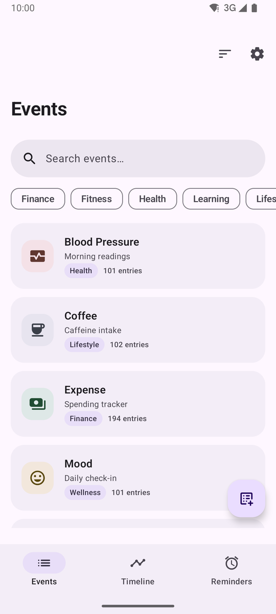  | 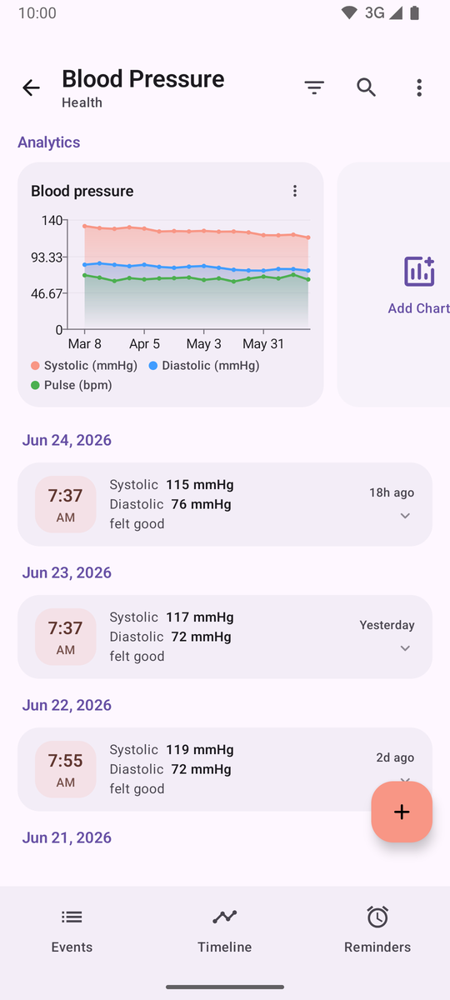 |  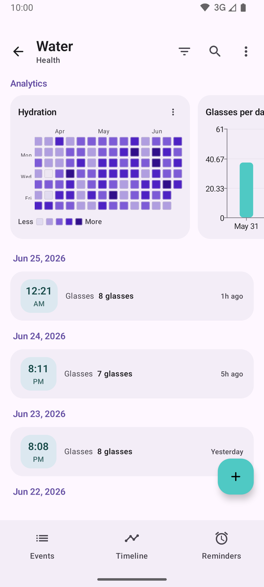 | 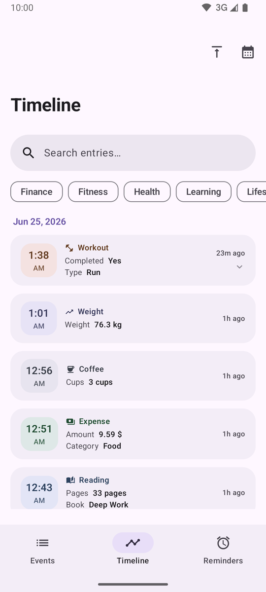 |
| 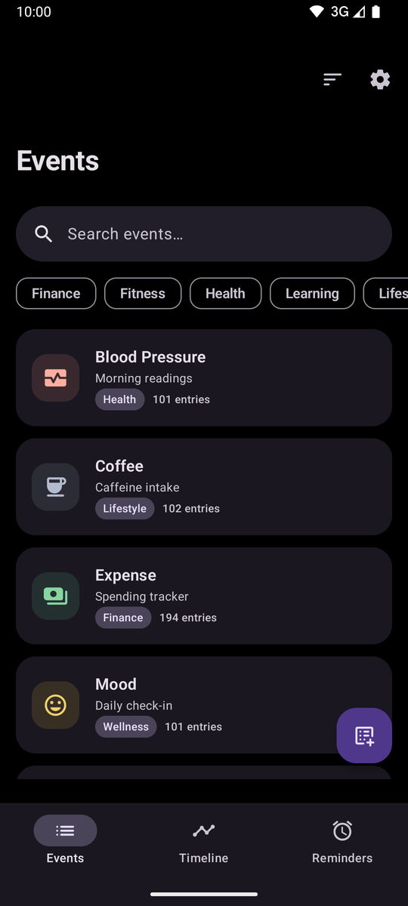 | 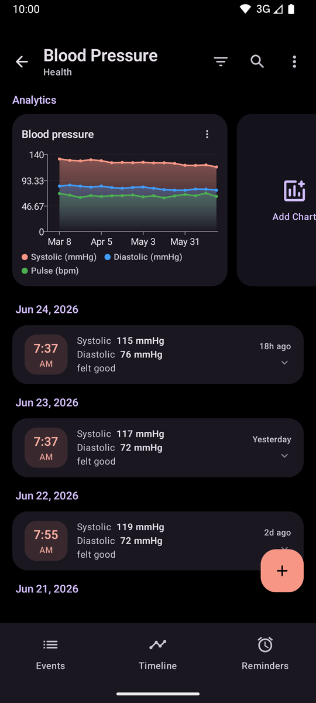 | 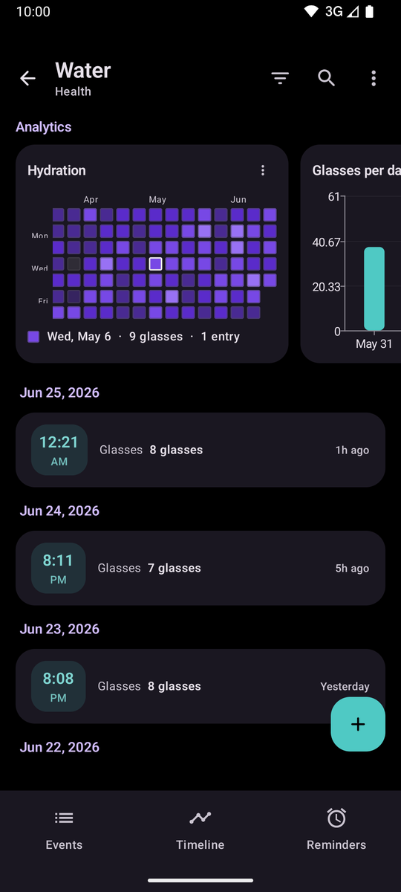 | 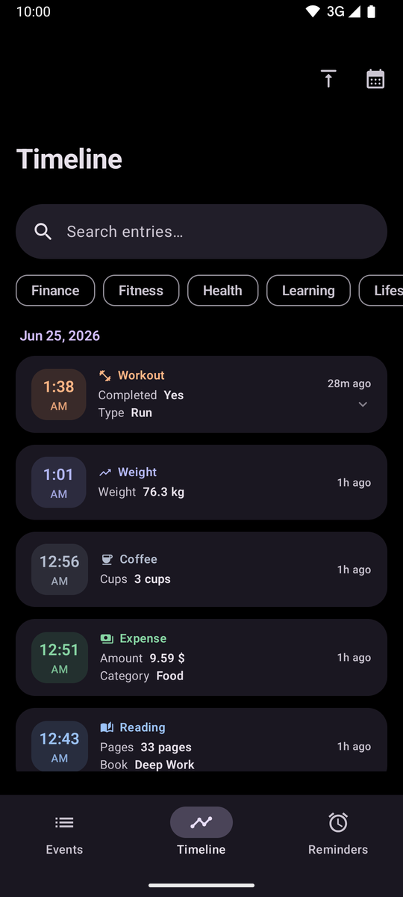 |

### More to explore

|                Reminders and alarms                 |               Spending breakdown                |                 Make it yours                  |                  Own your data                  |
| :-------------------------------------------------: | :---------------------------------------------: | :--------------------------------------------: | :---------------------------------------------: |
| 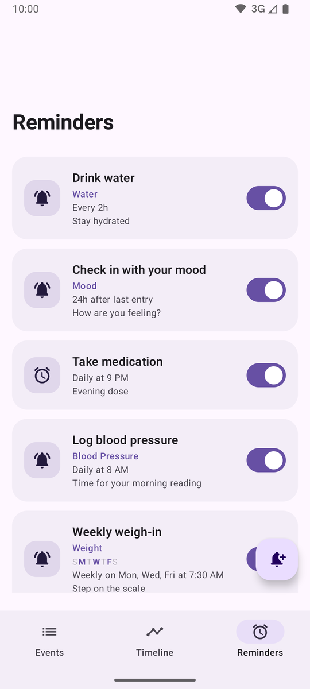 | 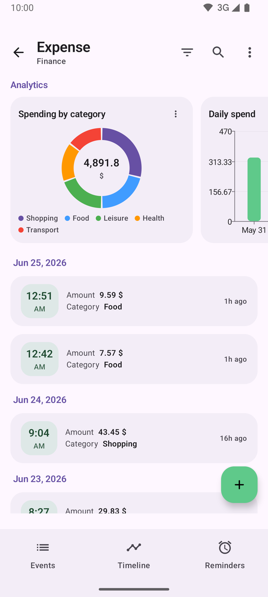 | 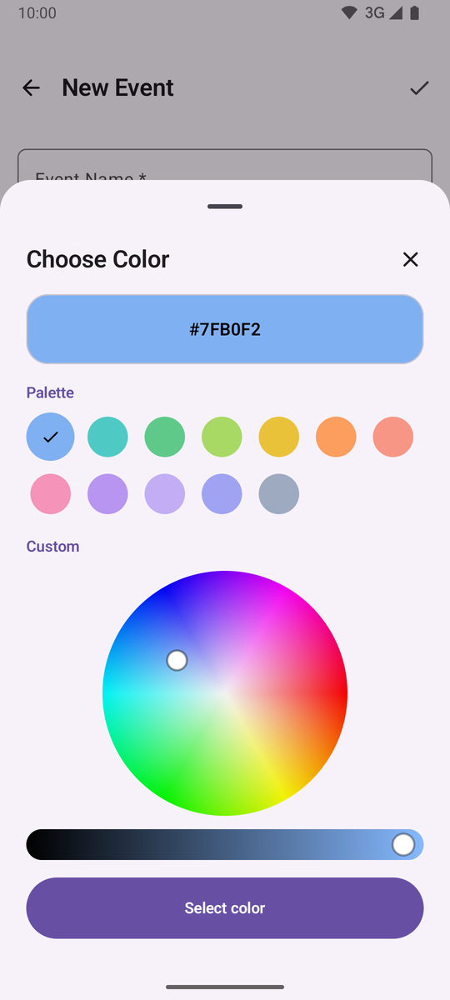 | 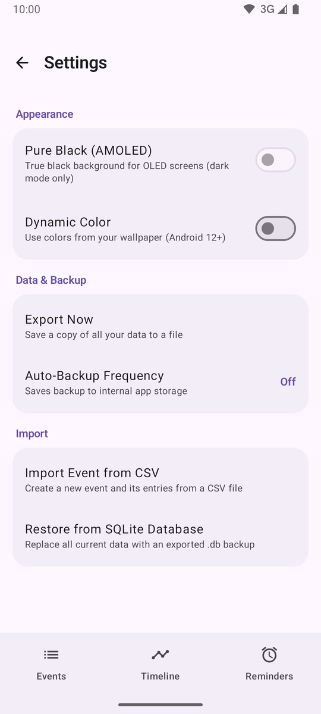 |

### On your home screen

|              Live timeline widget               |                Build a tracker                 |
| :---------------------------------------------: | :--------------------------------------------: |
| 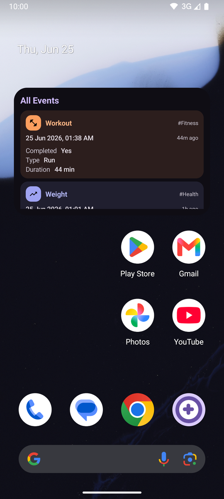 | 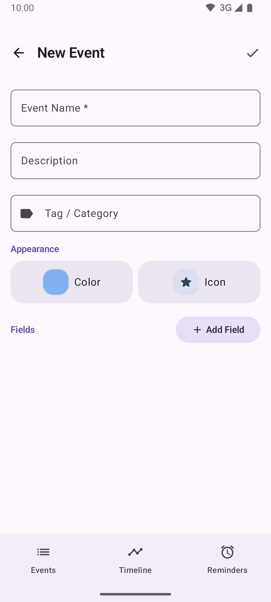 |

<br/>

## Installation

### Download

Grab the latest signed APK from the [Releases](https://github.com/Arkadipta/LifeLog/releases) page, then open it on your device to install. You may need to allow installation from your browser or file manager the first time.

**Requirements:** Android 8.0 (API 26) or newer.

### Build from source

LifeLog builds with the standard Android toolchain and JDK 17.

```bash
git clone https://github.com/Arkadipta/LifeLog.git
cd LifeLog
./gradlew :app:assembleDebug
```

The debug APK is written to `app/build/outputs/apk/debug/app-debug.apk`. To run the unit tests:

```bash
./gradlew :app:testDebugUnitTest
```

<br/>

## Usage

1. **Create a tracker.** Tap the button on the Events screen, give it a name, pick a color and icon, and add the fields you care about.
2. **Log entries.** Open a tracker and add an entry. Fields adapt to their type, so numbers get a number pad and choices get chips.
3. **See the trends.** Add one or more charts to a tracker: line, bar, donut, or heatmap. Tap a point or cell to inspect the value behind it.
4. **Stay on track.** Create a reminder, choose how it repeats, and pick a notification or a full-screen alarm.
5. **Keep it close.** Add a Timeline or Quick Add widget to your home screen for logging and review without opening the app.

<br/>

## Privacy and Data Ownership

LifeLog is built so that your information stays with you.

- **Local-first by design.** Every tracker, entry, reminder, and chart lives in an on-device database. There is no account to create and no cloud to sync to.
- **It cannot phone home.** LifeLog does not request the internet permission at all, so it is incapable of sending your data anywhere, by design rather than by promise.
- **No tracking.** There are no analytics, no ads, and no third-party SDKs watching what you log.
- **Open, portable exports.** Your data is never locked in. Export it any time in the format that suits you.

| Format     | Best for                                  | Notes                                                  |
| ---------- | ----------------------------------------- | ------------------------------------------------------ |
| **SQLite** | Complete, lossless backups                | A full copy of the database you can restore in one tap |
| **JSON**   | Portability and inspection                | A structured, human-readable snapshot of everything    |
| **CSV**    | Spreadsheets and external analysis        | One file per tracker, with a column for each field     |

You can also **restore** from a SQLite backup, schedule **automatic local backups** (the last 7 are kept on-device and restorable straight from Settings), and **import** existing records by mapping a CSV file into a new tracker.

<br/>

## Technical Stack

LifeLog is a single-module, fully native Android app written in Kotlin with a modern, testable architecture.

| Area               | Choice                                                            |
| ------------------ | ---------------------------------------------------------------- |
| Language           | Kotlin 2.0                                                       |
| UI                 | Jetpack Compose with Material 3 Expressive                       |
| Architecture       | MVVM, unidirectional state, repository layer                     |
| Persistence        | Room (SQLite) for data, DataStore for preferences               |
| Dependency control | Hilt                                                             |
| Charts             | Vico                                                             |
| Widgets            | Jetpack Glance                                                   |
| Background work    | AlarmManager for reminders, WorkManager for backups             |
| Serialization      | kotlinx.serialization                                            |
| Min / Target SDK   | 26 (Android 8.0) / 35 (Android 15)                              |

<details>
<summary><strong>A note on architecture</strong></summary>

<br/>

The codebase separates concerns into clear layers:

- **UI** is pure Compose, with each screen driven by a `ViewModel` that exposes immutable state.
- **Repositories** mediate between view models and the data layer, keeping Room and DataStore details out of the UI.
- **Domain logic** that is worth trusting (recurrence math, chart bucketing and aggregation, CSV parsing and type inference) lives in plain, side-effect-free Kotlin and is covered by unit tests.
- **Dependency injection** is handled by Hilt throughout, including the entry points used by Glance widgets.

This keeps the interesting logic easy to reason about and verify, independent of the Android framework.

</details>

<br/>

## Roadmap

LifeLog 1.0 is a complete, self-contained tracker. Shipped in this release:

- Custom event types with five field types
- Line, bar, donut, and heatmap charts with tap-to-inspect
- A unified, filterable, color-coded timeline
- Recurring reminders and lock-screen alarms
- Home-screen timeline and quick-add widgets
- SQLite, JSON, and CSV export, full restore, and CSV import
- Light, dark, AMOLED, and dynamic-color theming

Ideas under consideration for future releases:

- Optional, end-to-end encrypted backup and sync
- Additional chart types and richer dashboards
- Tablet and landscape layouts
- Localization and accessibility refinements

Have an idea? Open an issue and start the conversation.

<br/>

## Contributing

Contributions are welcome, whether that is a bug report, a feature idea, or a pull request.

1. Fork the repository and create a branch from `main`.
2. Make your change, matching the style and conventions of the surrounding code.
3. Run `./gradlew :app:testDebugUnitTest` and make sure the build is green.
4. Open a pull request describing what you changed and why.

For larger changes, opening an issue first to discuss the approach is appreciated.

<br/>

## License

LifeLog is released under the [MIT License](LICENSE). You are free to use, modify, and distribute it.

<br/>

<div align="center">

Built with Kotlin and Jetpack Compose.

</div>
